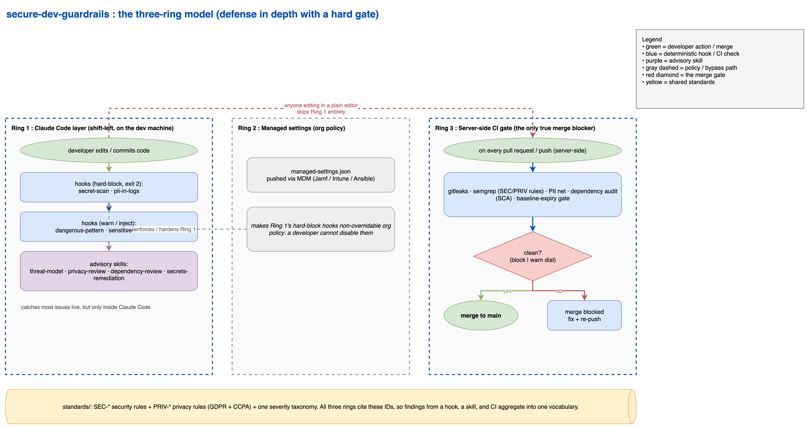

# secure-dev-guardrails

Security and privacy guardrails for a development org, built on Claude Code skills and hooks
plus a server-side CI gate. Targets GDPR + CCPA, the Python / JS-TS / Java-C# stack, and a
hybrid enforcement model (hard-block the unambiguous violations, warn on judgment calls).

The design rests on three rings, because no single mechanism can "ensure" compliance. See
[docs/three-ring-model.md](docs/three-ring-model.md).

Source: [docs/three-ring-flow.drawio](docs/three-ring-flow.drawio) (editable in draw.io).

## Layout

- `standards/`, the single source of truth. Security rules (SEC-*), privacy rules (PRIV-*,
  GDPR + CCPA), the severity taxonomy, the suppression baseline, and the two org policy files
  that the skills here (and any external review plugin you point at them) read. Everything else
  cites these IDs.
- `hooks/`, Claude Code hooks. `secret-scan.sh` and `pii-in-logs.sh` hard-block;
  `sensitive-file-context.sh` and `dangerous-pattern-warn.sh` warn/inject. Portable bash + jq,
  POSIX grep classes (run on BSD and GNU grep).
- `settings/`, `managed-settings.json` (enterprise policy, non-overridable) and `install.sh`
  (push via MDM with admin rights).
- `ci/`, `security-privacy.yml` reusable GitHub Actions workflow, `.pre-commit-config.yaml`,
  and the org `semgrep/` rule packs. This is the gate that actually blocks merges.
- `skills/`, new skills (`privacy-review`, `threat-model`, `dependency-review`,
  `secrets-remediation`) and `enhancements/` (drop-in specs for `code-review`,
  `security-review`, `spec-review`, `architect`).
- `docs/`, the three-ring model and developer onboarding.

## Install (per machine / fleet)

1. **Hooks + managed settings:** `sudo settings/install.sh` (or push via MDM). Installs hooks to
   `/usr/local/share/secure-dev-guardrails/` and the managed-settings policy to the OS path so
   developers cannot disable the hard blocks. Verify with `settings/install.sh --verify`.
2. **Skills:** copy `skills/<name>/` into the team's Claude Code skills directory. Apply the
   `skills/enhancements/*.md` changes to the existing code-review / security-review / spec-review
   / architect skills.
3. **CI:** reference `ci/security-privacy.yml` from each repo's workflow and make the check
   Required in branch protection. Install pre-commit per clone for local feedback.
4. **Tooling:** `gitleaks` and `semgrep` for full coverage. The hooks degrade to a warning (and
   lean on CI) when `gitleaks` is absent, so they never hard-fail on a missing tool.

## What is enforced where

- Hard-block (hook + CI): hardcoded secrets and credential files (SEC-SECRET-01/02), PII in logs
  (PRIV-LOG-01), real PII in fixtures (PRIV-ANON-01).
- Warn / review (hook + skills): injection, weak crypto, disabled TLS, dangerous patterns, and
  the privacy judgment calls (retention, deletion reachability, consent, transfers, subject
  rights).
- CI-only (needs a toolchain): SAST across the OWASP packs, SCA for known CVEs, license checks,
  baseline-expiry enforcement.

## The honest limit

This is defense in depth with a hard gate, not a guarantee. The hooks catch the unambiguous
cases, the skills surface the judgment calls, CI blocks the merge. Whether a field is needed for
its purpose, or a destination is an approved processor, stays a human decision (DPO, security
team). Do not describe the system as "ensuring" compliance on its own.

## Model routing

The skills in this pack pin a Claude Code model alias in their frontmatter, so each artifact runs on the tier its work needs:

- `model: fable`: planning and judgment-heavy review
- `model: opus`: execution and content work
- `model: sonnet`: routine or mechanical steps

If a pinned model is not available on your plan, or you prefer different routing, edit the `model:` line in the artifact's frontmatter, or delete it to inherit your session model.
