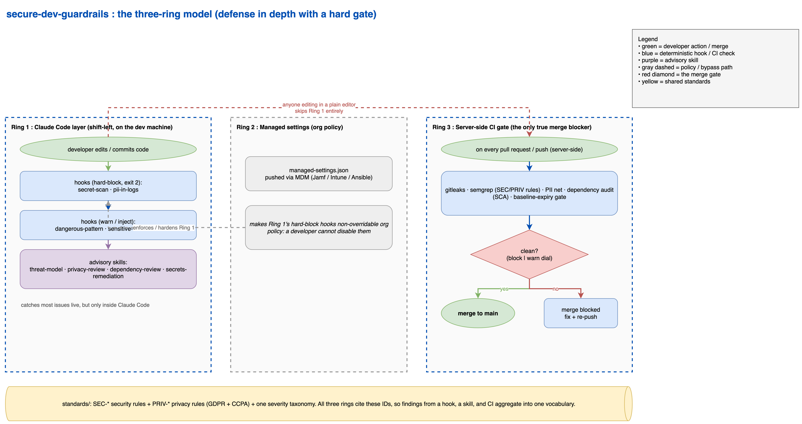

# secure-dev-guardrails

Security and privacy guardrails for a development org, built on Claude Code skills and hooks
plus a server-side CI gate. Targets GDPR + CCPA, the Python / JS-TS / Java-C# stack, and a
hybrid enforcement model (hard-block the unambiguous violations, warn on judgment calls).

The design rests on three rings, because no single mechanism can "ensure" compliance. See
[docs/three-ring-model.md](docs/three-ring-model.md).

Source: [docs/three-ring-flow.drawio](docs/three-ring-flow.drawio) (editable in draw.io).

## Layout

- `standards/`, the single source of truth. Security rules (SEC-*) including the CI and
  pipeline rules (SEC-CI-*), the runtime and detection rules (SEC-RUN-*), privacy rules
  (PRIV-*, GDPR + CCPA), AI and agent rules (SEC-AI-*)
  for systems where a model reads outside content, the severity taxonomy, the suppression
  baseline, and the two org policy files that the skills here (and any external review plugin
  you point at them) read. Everything else cites these IDs. `framework-mapping.md` ties all 58
  rules to NIST SSDF, the OWASP Top 10 2025, CWE, the OWASP LLM Top 10 2025, and GDPR/CCPA, so
  a rule can be defended in an audit rather than only asserted.
- `hooks/`, Claude Code hooks. `secret-scan.sh` and `pii-in-logs.sh` hard-block;
  `sensitive-file-context.sh` and `dangerous-pattern-warn.sh` warn/inject. Portable bash + jq,
  POSIX grep classes (run on BSD and GNU grep).
- `settings/`, `managed-settings.json` (enterprise policy, non-overridable) and `install.sh`
  (push via MDM with admin rights).
- `ci/`, `security-privacy.yml` reusable GitHub Actions workflow, `.pre-commit-config.yaml`,
  the org `semgrep/` rule packs, `check-workflow-hardening.sh`, which reads the repo's own
  workflow files, and `check-kev.py`, which checks advisory ids against CISA's Known Exploited
  Vulnerabilities catalogue. This is the gate that actually blocks merges.
- `skills/`, new skills (`privacy-review`, `threat-model`, `dependency-review`,
  `secrets-remediation`) and `enhancements/` (drop-in specs for `code-review`,
  `security-review`, `spec-review`, `architect`).
- `docs/`, the three-ring model and developer onboarding.

## Install (per machine / fleet)

1. **Hooks + managed settings:** `sudo settings/install.sh` (or push via MDM). Installs hooks to
   `/usr/local/share/secure-dev-guardrails/` and the managed-settings policy to the OS path so
   developers cannot disable the hard blocks. Verify with `settings/install.sh --verify`.
2. **Skills:** copy `skills/<name>/` into the team's Claude Code skills directory. Apply the
   `skills/enhancements/*.md` changes to the existing code-review / security-review / spec-review
   / architect skills.
3. **CI:** reference `ci/security-privacy.yml` from each repo's workflow and make the check
   Required in branch protection. Install pre-commit per clone for local feedback.
4. **Tooling:** `gitleaks` and `semgrep` for full coverage. The hooks degrade to a warning (and
   lean on CI) when `gitleaks` is absent, so they never hard-fail on a missing tool.

## What is enforced where

- Hard-block (hook + CI): hardcoded secrets and credential files (SEC-SECRET-01/02), PII in logs
  (PRIV-LOG-01), real PII in fixtures (PRIV-ANON-01).
- Warn / review (hook + skills): injection, weak crypto, disabled TLS, dangerous patterns, and
  the privacy judgment calls (retention, deletion reachability, consent, transfers, subject
  rights).
- CI-only (needs a toolchain): SAST across the OWASP packs, SCA for known CVEs, license checks,
  baseline-expiry enforcement.
- Known exploited (SEC-DEP-04): `dependency-review` step 2b runs `ci/check-kev.py` over the
  advisory ids the SCA reported. A KEV listing outranks the CVSS score, because a score guesses
  how bad a flaw could be while a listing says somebody is exploiting it now, with a remediation
  date CISA sets. The script exits 2, never 0, when it cannot read the catalogue: a KEV check
  that reports clean because the network was down converts a look into a tick.
- Pipeline (CI + pre-commit): actions pinned to a commit SHA and a narrowed build token
  (SEC-CI-01/02). This one reports by default rather than blocking, and the reason is measured
  rather than polite: of the three repositories with workflow files on the machine this pack was
  written on, three fail the pinning rule and none fails the token rule. A gate that stops every
  existing repository on adoption day is removed by whoever meets it late in the day, so the
  `pin_actions` input starts at `warn` and a team flips it to `block` once its backlog is clear.
  An accepted action goes in `standards/baseline.yml` with an owner and an expiry.

## The honest limit

**Detection has a deliberate hole and it is named rather than hidden.** SEC-RUN-01 to 03 make
detection something you design at threat-model time, test once so you know the alert fires, and
size against your log retention. They do NOT cover continuous container-level detection, meaning
container escape, cryptomining, reverse shells and anomalous process execution. That needs a
runtime protection platform and somebody watching it, and a rule assuming a security operations
team you do not have is a wish rather than a standard.

The two judgment-shaped pipeline rules are not enforced by anything: whether a workflow runs
untrusted code with credentials (SEC-CI-03), and whether an expression reaches a shell
(SEC-CI-04), are questions about how parts of a file relate, and a pattern match on either
produces noise. They belong to review, and the standards file says so beside each one.

This is defense in depth with a hard gate, not a guarantee. The hooks catch the unambiguous
cases, the skills surface the judgment calls, CI blocks the merge. Whether a field is needed for
its purpose, or a destination is an approved processor, stays a human decision (DPO, security
team). Do not describe the system as "ensuring" compliance on its own.

## Model routing

The skills in this pack pin a Claude Code model alias in their frontmatter, so each artifact runs on the tier its work needs:

- `model: fable`: planning and judgment-heavy review
- `model: opus`: execution and content work
- `model: sonnet`: routine or mechanical steps

If a pinned model is not available on your plan, or you prefer different routing, edit the `model:` line in the artifact's frontmatter, or delete it to inherit your session model.
